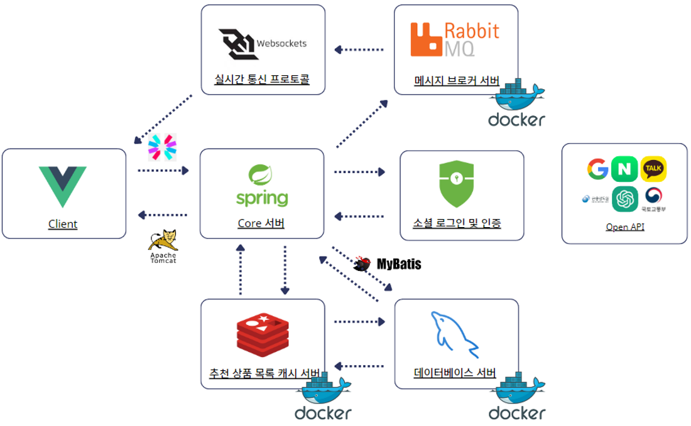
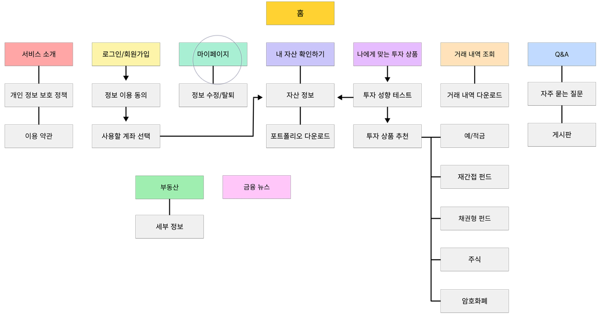
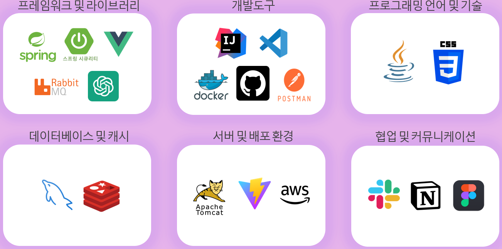

# 🌟 Lucky Rich

[](LICENSE)

**MZ 세대를 위한 자산 관리 서비스**, Lucky Rich는 자산 관리, 투자 분석 및 맞춤형 금융 상품 추천 기능을 제공합니다.

<br>
<p align="center">
   
</p>

---

## ✨ 주요 기능

- 📊 **포트폴리오 관리**: 사용자 맞춤형 투자 포트폴리오 자동 생성
- 💰 **자산 분석**: 시간에 따른 자산 시각화 및 분석
- 🔍 **금융 상품 추천**: 사용자 프로필에 따른 맞춤형 금융 상품 추천
- 💹 **실시간 자산 비교**: 비슷한 연령대의 자산과 비교
- 📈 **트렌드 추적**: 자산 증가 추이 및 투자 동향 추적
 
 ### 1. 투자 성향 분석을 통한 개인맞춤형 추천
 
 ### 📝 투자 성향 테스트를 통한 상품 추천
 - 테스트 총점에 따라 사용자의 성향을 나누고 그에 맞는 투자 상품을 추천합니다.
 - 성향은 총 5개로, 각각 안정형/안정추구형/위험중립형/적극투자형/공격투자형으로 이루어져 있습니다.
 - 안정형은 예적금 상품, 안정추구형은 채권형 펀드 상품, 위험중립형은 재간접 펀드 상품, 적극투자형은 주식 상품, 공격투자형은 암호화폐를 추천합니다.
 
 ### 👍 추천 상품 상세 페이지
 - 테스트를 마친 사용자에게 성향에 대한 설명과 해당 상품을 추천하는 이유를 제공합니다.
 - 사용자는 추천 받은 상품의 TOP100 리스트를 테이블 형태로 볼 수 있습니다.
 - 종목명을 누르면 해당 종목에 대한 상세 정보를 볼 수 있습니다.
 
 ### 2. 💰 한눈에 내 자산 확인하기
 - 사용자가 가지고 있는 모든 자산을 직관적인 대시보드로 나타냅니다.
 - 사용자의 자본에 맞는 투자 상품을 추천합니다.
 - 자산 분포, 목표 자산 달성도, 자본 증감 추이, 계좌 보유 잔액, 카테고리별 소비 분석, 내 또래의 자산 분포를 시각화된 차트로 볼 수 있습니다.
 
 ### 3. 🎨 AI 기반의 스마트 자산 관리 조언
 - 자산 포트폴리오를 다운 받으면 사용자의 모든 자산정보와 금융 트렌드, 사용자 데이터에 기반한 맞춤형 조언이 제공됩니다.
 - 포트폴리오 다운이 완료되면 실시간 알림을 받을 수 있어 대기하는 시간을 효율적으로 사용 가능합니다.
 
 ### 4. 💵 거래 내역 조회
 - 사용자가 가진 계좌별로 거래 내역을 조회할 수 있습니다.
 - 날짜, 입금/출금, 카테고리 필터링을 통해 원하는 내역을 쉽고 빠르게 찾을 수 있습니다.
 - 거래 내역을 csv 파일로 다운 받아 개인적으로 백업 및 보관이 가능합니다.
 
### 5. ❓ Q&A
- 자주 묻는 질문 9개에 대한 답변을 볼 수 있습니다.
- 게시판에 직접 질문 게시글을 올릴 수 있으며, 관리자만 댓글로 답변을 달 수 있습니다.

---

## 🚀 데모

🔗 [Live Demo](http://your-demo-url.com)


---

## 📋 목차

- [설치 방법](#-설치-방법)
- [사용 방법](#-사용-방법)
- [시스템 아키텍처](#-시스템-아키텍처)
- [구조도](#-구조도)
- [API 문서](#-api-문서)
- [ERD](#-erd)


---

## 🔧 설치 방법

아래 단계를 따라 로컬 환경에 프로젝트를 설치하세요.

1. 저장소 클론:
   ```bash
   git clone [https://github.com/terrydlek/LuckyRich.git](https://github.com/terrydlek/KB-LuckyRich.git)

2. 프로젝트 디렉토리로 이동:
   ```bash
   cd LuckyRich

3. 의존성 설치:
   ```bash
   npm install

4. 개발 서버 실행:
   ```bash
   npm run dev

---

## 📖 사용 방법

회원가입: 회원 가입 후 자산 관리 시작.

계좌 연결: 은행 및 투자 계좌를 연동하여 자산 데이터 조회.

포트폴리오 생성: '포트폴리오 생성' 버튼을 통해 맞춤형 투자 전략 생성.

분석 확인: 재무 상태에 대한 상세 분석 보고서 제공.

---

## 📚 시스템 아키텍처
<br>
<p align="center">

</p>
---

## 📚 구조도
<br>
<p align="center">

</p>

---

## 📚 ERD
<br/>
<p align="center">
   
</p>

---

## 📚 개발 환경
<br/>
<p align="center">
   
</p>

---

### 주요 포인트:
1. **시각적 요소**: 프로젝트 뱃지와 아이콘을 사용해 가독성 높임.
2. **데모 및 이미지**: 실시간 데모 링크와 프로젝트 스크린샷, GIF 등 추가.
3. **깔끔한 목차**: 사용자들이 문서를 쉽게 탐색할 수 있도록 목차 구성.
4. **설치 및 사용법**: 명확한 설치 방법과 사용 예시 제공.
5. **API 문서**: 주요 엔드포인트를 간단히 소개하고 전체 문서로 링크 연결.

---
### 팀원
| [황세호](https://github.com/ssoo1234) | [박제욱](https://github.com/terrydlek) |[김재이](https://github.com/Kim-Jaei) | [이시윤](https://github.com/siyun2)
| :---: | :---: | :---: | :---: |
|  |  |  |  | 
| Full-Stack | Full-Stack | Full-Stack | Full-Stack |
