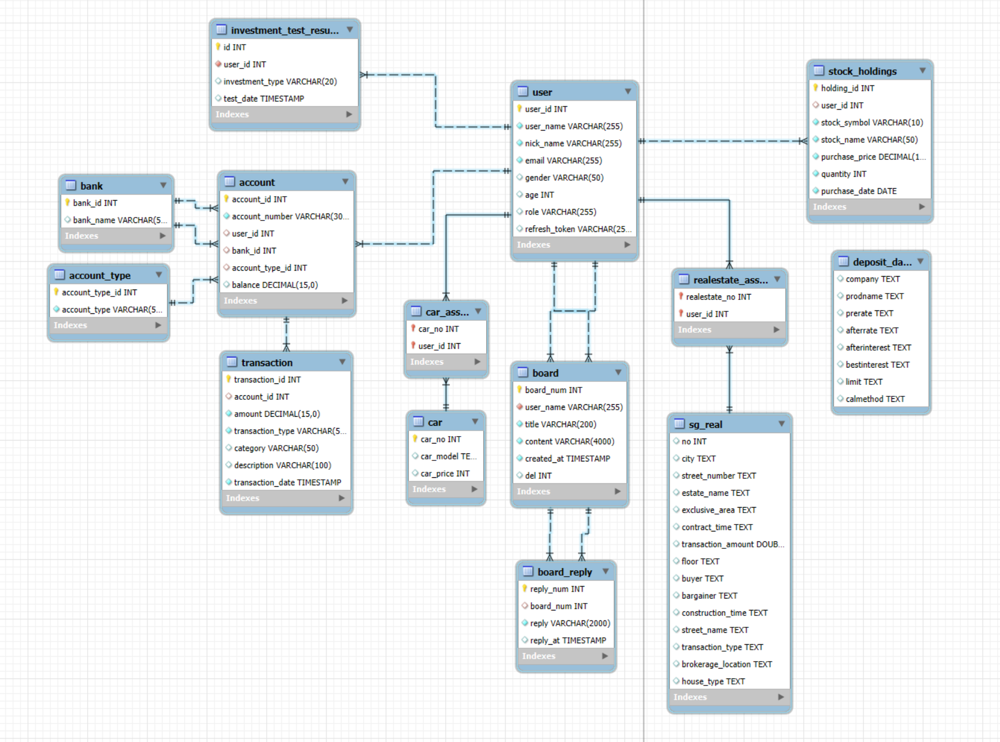

# 🌟 Lucky Rich

[](LICENSE)

**MZ 세대를 위한 자산 관리 서비스**, Lucky Rich는 자산 관리, 투자 분석 및 맞춤형 금융 상품 추천 기능을 제공합니다.

자산관리 대표 이미지 들어갈 자리

---

## ✨ 주요 기능

- 📊 **포트폴리오 관리**: 사용자 맞춤형 투자 포트폴리오 자동 생성
- 💰 **자산 분석**: 시간에 따른 자산 시각화 및 분석
- 🔍 **금융 상품 추천**: 사용자 프로필에 따른 맞춤형 금융 상품 추천
- 💹 **실시간 자산 비교**: 비슷한 연령대의 자산과 비교
- 📈 **트렌드 추적**: 자산 증가 추이 및 투자 동향 추적

주요기능 설명 들어갈 자리

---

## 🚀 데모

🔗 [Live Demo](http://your-demo-url.com)


---

## 📋 목차

- [설치 방법](#-설치-방법)
- [사용 방법](#-사용-방법)
- [시스템 아키텍처](#-시스템-아키텍처)
- [구조도](#-구조도)
- [API 문서](#-api-문서)
- [ERD](#-erd)


---

## 🔧 설치 방법

아래 단계를 따라 로컬 환경에 프로젝트를 설치하세요.

1. 저장소 클론:
   ```bash
   git clone [https://github.com/terrydlek/LuckyRich.git](https://github.com/terrydlek/KB-LuckyRich.git)

2. 프로젝트 디렉토리로 이동:
   ```bash
   cd LuckyRich

3. 의존성 설치:
   ```bash
   npm install

4. 개발 서버 실행:
   ```bash
   npm run dev

---

## 📖 사용 방법

회원가입: 회원 가입 후 자산 관리 시작.

계좌 연결: 은행 및 투자 계좌를 연동하여 자산 데이터 조회.

포트폴리오 생성: '포트폴리오 생성' 버튼을 통해 맞춤형 투자 전략 생성.

분석 확인: 재무 상태에 대한 상세 분석 보고서 제공.

---

## 📚 시스템 아키텍처

아키텍처 들어갈 자리

---

## 📚 API 문서

API 명세서 이미지 들어갈 자리

---

## 📚 구조도
<br>


---

## 📚 ERD
<br/>


---

## 📚 개발 환경
이미지

---

### 주요 포인트:
1. **시각적 요소**: 프로젝트 뱃지와 아이콘을 사용해 가독성 높임.
2. **데모 및 이미지**: 실시간 데모 링크와 프로젝트 스크린샷, GIF 등 추가.
3. **깔끔한 목차**: 사용자들이 문서를 쉽게 탐색할 수 있도록 목차 구성.
4. **설치 및 사용법**: 명확한 설치 방법과 사용 예시 제공.
5. **API 문서**: 주요 엔드포인트를 간단히 소개하고 전체 문서로 링크 연결.
